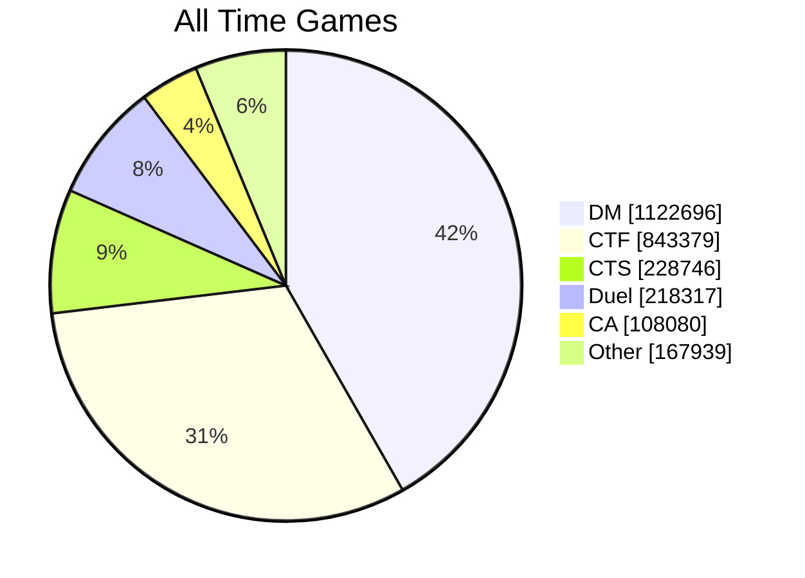
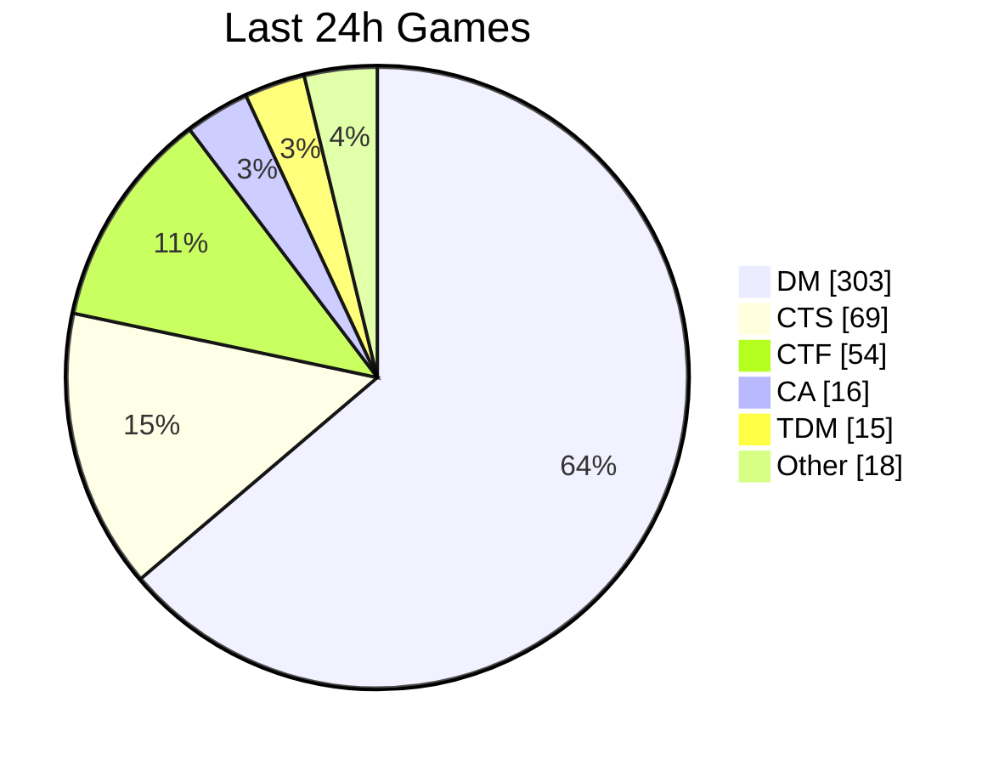
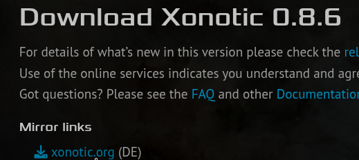
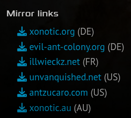
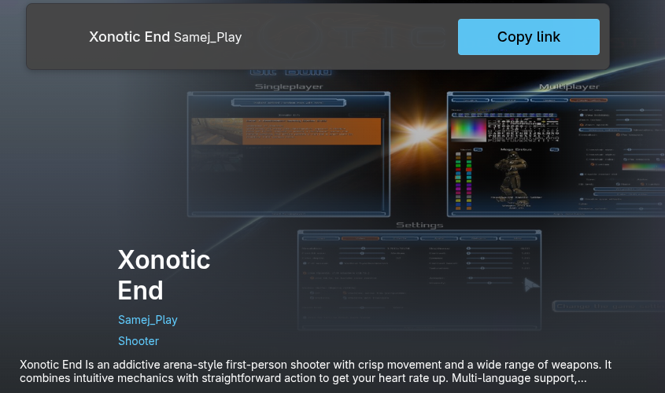
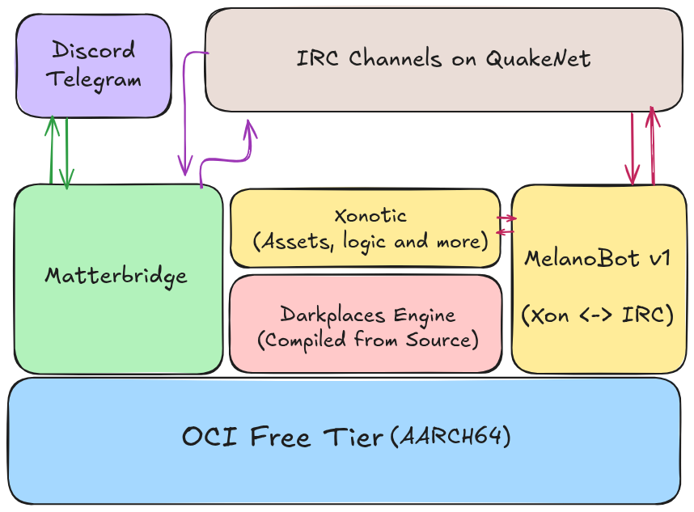
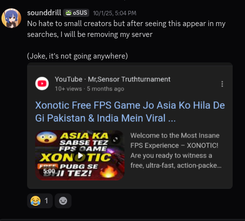
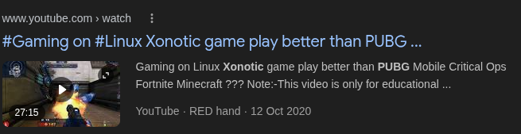
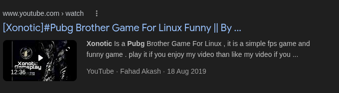
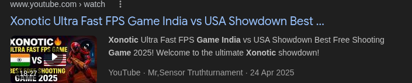

---
# try also 'default' to start simple
theme: seriph
# random image from a curated Unsplash collection by Anthony
# like them? see https://unsplash.com/collections/94734566/slidev
# some information about your slides (markdown enabled)
title: Welcome to Slidev
info: |
  ## Slidev Starter Template
  Presentation slides for developers.

  Learn more at [Sli.dev](https://sli.dev)
# apply UnoCSS classes to the current slide
class: text-center
# https://sli.dev/features/drawing
drawings:
  persist: false

# slide transition: https://sli.dev/guide/animations.html#slide-transitions
transition: slide-left
# enable MDC Syntax: https://sli.dev/features/mdc
mdc: true
# duration of the presentation
duration: 20min
---

</img>

<a class="absolute bottom-8 left-0.3/2 -translate-x-1/2" href="https://www.wikidata.org/wiki/File:Xonotic_logo.svg">Image is licensed Under GPLv2</a>

  
    <carbon:arrow-right class="inline"/>
  

---
layout: 'two-cols'
---

::left::

# Xonotic

A fun, past paced, Open Source(GPLv3+) Arena First Person Shooter!

::right::

### Timeline of evolution

<GameTimeline :items="timelineData" />

<!-- 
Presenter Notes:

- 1996: id Software releases Quake and subsequently releases the source code for its engine under the GPL
- 2005: Nexuiz, a free and open-source arena first-person shooter game, is first released. It used the DarkPlaces engine, an advanced engine derived from the Quake engine, as its base.
- 2010: A controversy arises when the original developers of Nexuiz sell the rights to the name to Illfonic, who then developed and released a commercial version on Steam. The existing community, committed to a truly free and open-source project, decides to fork the game.
- 2010 to Now: The community fork begins development with the goal of improving the game and avoiding past mistakes, leading to the birth of the Xonotic project. 
  - The initial release of Xonotic is launched, carrying forward the spirit and gameplay of the original community-focused Nexuiz.

Focus: game screenshot

Introduction and engine used

Comparison to quake and unreal tournament

-->

---

# Player Statistics(Excluding Xonotic India)

Sourced from https://stats.xonotic.org on 16th Jan 2026

  
Since Oct 2011

  
297,588 Players | 2.6M Games

  

 
Past 24 Hours(as of Jan 16 2026)
 
371 Players | 475 Games

<!-- 
Presenter Notes:
200k lifetime player count doesn't sound like much but this clearly shows the game is cared for by the community! 
-->

---
layout: 'two-cols-header'
---

# Situation in South/South-East Asia(as of 2022)

::left::
[From: Reddit in r/linux_gaming 
"Any xonotic players in South Asia?"](https://www.reddit.com/r/linux_gaming/comments/h032s7/any_xonotic_players_in_south_asia/)

There is clear demand! 

We see a small influx of users, especially every time people move to linux and discover it from their distribution's `Software Center`!

::right::
</img>

<!--
Presenter Notes:
Costs nothing for me to run!

People in India are also generally more accepting of linux and the paradigm shift as students and devs quickly become power users, sometimes even adopting arch linux or nixOS. 

They tend to exploratorily try out various games that are recommended by their linux software centers.

Screenshot of users talking about setting up servers on reddit 
-->

---
layout: 'two-cols'
---

# Getting Started

- Step-1: Download it from https://xonotic.org/download
- Step-2: Extract the zip package
- Step-3: Run the executable

Alternatively, it can be found on:
- Flathub for Flatpak users only
- brew/Homebrew for MacOS users only

Supported by Windows, MacOS*, Linux Distros!

::right::

<!--
Presenter Notes:
Download Link QR codes(warning 1.2gb)
I will be running it from my distribution's package, sudo zypper install xonotic
-->

---

# AVOID THE MICROSOFT STORE VERSION, IT IS FAKE/Unofficial
last minute slide lol

</img>

<!--
Presenter Notes:
Xonotic End by Samej_Play
-->

--- 
layout: 'two-cols-header'
---

# Game Mechanics(Video Guide)
Xonotic: A 10,000 ft Overview for Beginners (antibody)

<!--
Presenter Notes:
Overview video by antibody

Explains simple things like map guides, weapons, etc.
-->

<iframe src="https://www.youtube.com/embed/ev-rOXCzy_Y" title="Xonotic: A 10,000 ft Overview for Beginners" frameborder="0" allow="accelerometer; autoplay; clipboard-write; encrypted-media; gyroscope; picture-in-picture; web-share" referrerpolicy="strict-origin-when-cross-origin" allowfullscreen></iframe>

::right::

https://www.youtube.com/watch?v=ev-rOXCzy_Y

---
layout: 'two-cols-header'
---

# Xonotic India

  

    Xonotic India is a community server run by us! We also maintain game bridges and community chats on IRC, Telegram and Discord.
  

  

    
    <a href="https://india.xonotic.au" class="mt-4 font-mono text-sm opacity-70 hover:opacity-100">
      india.xonotic.au
    </a>
  

  <HorizontalMetroTimeline :items="xonoticTimeline" />

<!--
Presenter Notes:

This had been a long time project for me, even back then. 
I was getting tired of high lag playing on Australian servers.

the server and what it's about
Introduction what why when

QR with website

Origin Work in progress timeline
-->

---
layout: 'two-cols-header'
---

# Current Setup

::left::
</img>

::right::

Problems:
- Melanobot v1 is EOL/Unmaintained. 
  - The chat stops syncing every 10 or 14 days, need to restart server!
- Server doesn't scale past 25 or 50 concurrent players
- Lobby is dead most of the time(less than 3 concurrent players)
- Uses custom source-compiled darkplaces
  - Stat counter services see this as a "modified" server(stats.xonotic.org does not save our data)
- 0 Social Media Presence, not even SEO
- Runs at-cost, where the cost is 0. 
  - I do not get paid for this, I do not pay for this.

<!-- 
Presenter Notes:

Issues(considered "modified" since darkplaces is compiled from source and a few more things, chat relay dies every few days, not built to scale past 25-50 concurrent users)
-->

---
layout: 'two-cols'
---

# Why this? 
Why now? Why at all?

Why not?

</img>

::right::

"Xonotic Free FPS Game Jo Asia Ko Hila De Gi Pakistan & India Mein Viral ..."

"ASIA KA SASE TEZ FPS GAME  
***XONOTIC***  
PUBG SE BHI TEZ"

\- Mr,Sensor Truthturnament (2025)

<!--
Presenter Notes:
Saw one of videos these and got some motivation lol

I wanted to do right by the people who stumble upon this game and feel bad because servers are deadchat. 

Revival (PUBG/BGMI-esque video thumbnail shown, post-indiafoss motivation to go back to half abandoned things and work on them)

more funny screenshots in the next slide
-->

---

---
layout: 'two-cols-header'
---

# Thank you for attending!

Gameplay demo will begin soon, if we have time. 

::left::

https://github.com/sounddrill31/XonoticIndia-FOSSUnited-Blr-Jan26

https://india.xonotic.au/slides

::right::

# LLM Involvement
Presentation, Content and CFP is original, otherwise untouched by an LLM :)

AI Assisted:
- Website Code for https://india.xonotic.au
- Presentation: 
  - Vue Components(Timeline)
  - Diagram Formatting(Mermaid Pie Chart)
  - HTML scaffolding(Snippets Examples for images and more)

<!--
QR and URL to this presentation

Presenter Notes:
Time for Demo!!!
-->